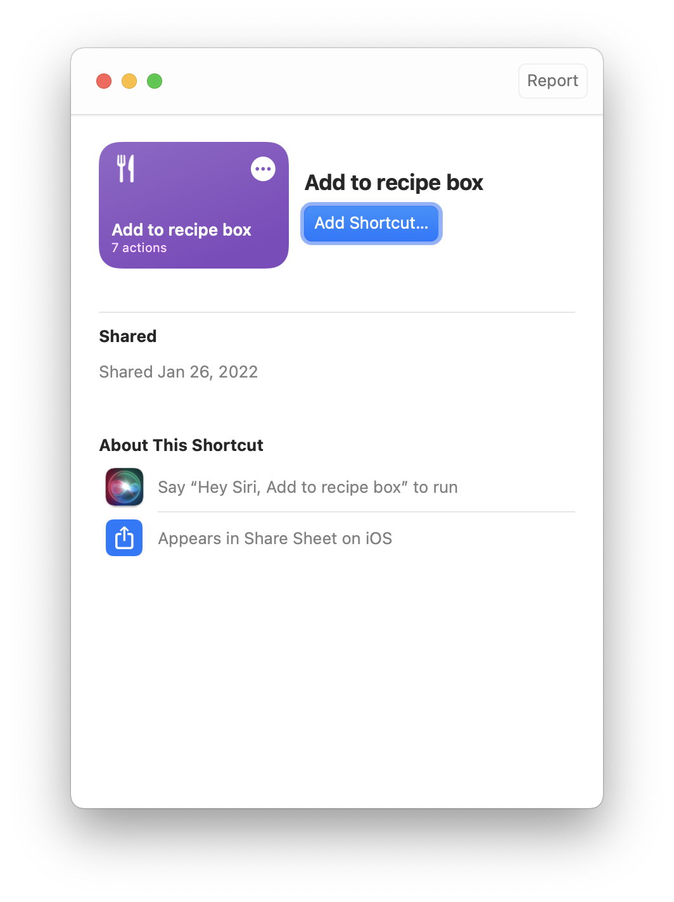

# Bookmark shortcut

Download the [Add to recipe shortcut](Add%20to%20recipe%20box.shortcut) to quickly create GitHub issues for the action.

## Set up

When you first open the shortcut, it will ask you to enter your GitHub repository and a GitHub token.

## Using the shortcut

From your phone:

1. From the page, click the **Share** button.
2. Click **Add to recipe box** from the sharesheet.
3. The action will automatically create and open a GitHub issue.

From your computer:

1. Copy the URL for the page you want to bookmark.
2. From Shortcuts, click the play icon for **Add to recipe box** and paste the URL.
3. The action will automatically create and open a GitHub issue.
